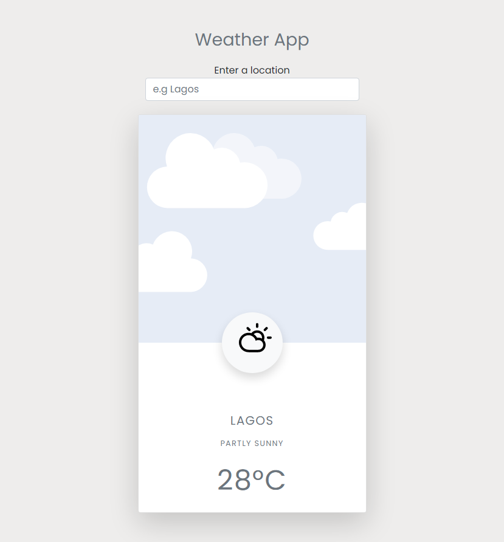

### Weather App

#### This is a a dynamic webapp that gets the information regarding the weather of a location.

#### It uses accuweather api: where data are gotten and used to manipulate the DOM 

#### Built with Html, CSS, Bootstrap and JavaScript

#### What i learnt?
1. How to fetch data from an Api endpoint using async await
```JS
	const getCity = async (city) => {
	const response = await fetch(`https://dataservice.accuweather.com/locations/v1/cities/search?apikey=${key}&q=${city}`);
	const data = await response.json();

	return data[0];
}
```
1. How to manipulate the DOM using data gotten from the Api endpoint
```JS
	details.innerHTML = `

				<h5 class="my-3">${cityDetails.EnglishName}</h5>

				<div class="my-3">${weather.IconPhrase}</div>

				<div class="display-4 my-4">
					<span>${celsius}</span><span>&deg;C</span>
				</div> `
```
#### Link to the live website: [WeatherApp](https://outkeeper.netlify.app/ "Outkeeper live site")

#### Design Image
#### Desktop View


#### Credits: NetNinja and Scythe